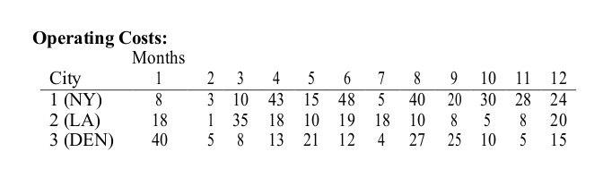
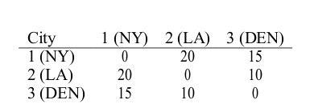
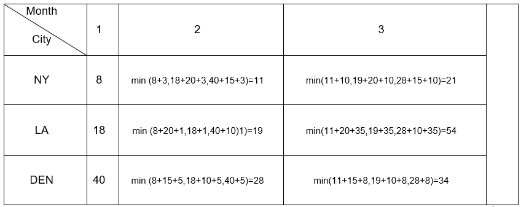

## Solution

The first solution to this problem is to use recursive functions. The recursive function has two inputs for solving this problem. The first entry is the moon number, and the second entry is the city name in the month in question.


This function takes advantage of the functions OPTIMAL(i-1, CA) and OPTIMAL(i-1, DC) optimal mode for the two cities in the previous month and then adding the cost of deployment in the i'th month and the cost of moving Selects the minimum mode.

Using these formulas, we can get fewer costs in n'th month in each city.

```python
OPTIMAL(𝑖, DC) = min (DC𝑖 + OPTIMAL(𝑖 − 1, DC), DC𝑖 + OPTIMAL(𝑖 − 1, C𝐴) + 𝑅𝐶 (CA, DC), DC𝑖 + OPTIMAL(𝑖 − 1, CLE) + 𝑅𝐶 (CLE, DC))

OPTIMAL(𝑖, CA) = min (CA𝑖 + OPTIMAL(𝑖 − 1, CA), CA𝑖 + OPTIMAL(𝑖 − 1, DC) + 𝑅𝐶 (CA, DC), CA𝑖 + OPTIMAL(𝑖 − 1, CLE) + 𝑅𝐶 (CLE, CA))

OPTIMAL(𝑖, CLE) = min (CLE𝑖 + OPTIMAL(𝑖 − 1, CLE), CLE𝑖 + OPTIMAL(𝑖 − 1, DC) + 𝑅𝐶 (CLE, DC), CLE𝑖 + OPTIMAL(𝑖 − 1, 𝐿𝐴) + 𝑅𝐶 (CLE, 𝐿𝐴))

```
So the optimum minimum cost is between different cities in n'th month.

```python
𝑎𝑛𝑠 = min {OPTIMAL(𝑛, DC), OPTIMAL(𝑛, CA), OPTIMAL(𝑛, CLE)}
```

To solve this problem in Dynamic Programming, we need to construct a matrix with the number of rows as large as the number of cities and the same number of columns as given. In the first column, only the first column information for the monthly cost matrix is entered in each city.
To calculate the next column for each city, just get the lowest value between the "costs of the same city until the last month + cost
Operations in the new month and the costs of other cities until the previous month + Remittance + Cost of operation in the new month"

For example, if Table 1 relates to the cost of the company over 12 months and in 3 cities NY, LA and DEN, and Table 2 refers to the cost of moving between the three cities, then the first and second columns of the matrix used are visible in Table 3.

Table 1

Table 2

Table 3

### Traceback

To track the right path, we have an array for each city. The values of this array for each city include the cities that need to be placed to achieve optimal conditions. In the pseudocode, the optimalLAPath, optimalNYPath and optimalDENPath variables are used for tracking operations and, depending on the best possible path; one is selected.

### Time complexity

The time complexity of the above algorithm is n2 × 𝑘. 𝑘 Indicates the number of cities and 𝑛 represents the number of months. Because the number of replicas of the main ring in the pseudo-code is the number of months of the problem. Also at each turn and for each city, the number of existing cities should be checked if, so that each city can find the most optimal route to that moment, the complexity of this time, and in total per month for all cities 𝑘2

### Members

Ali Daghighi
```python
```
Mohammad Bagher Abedi Sagha
```python
```
Shahriar Shahbazi Jalali Farahani


```python

```
